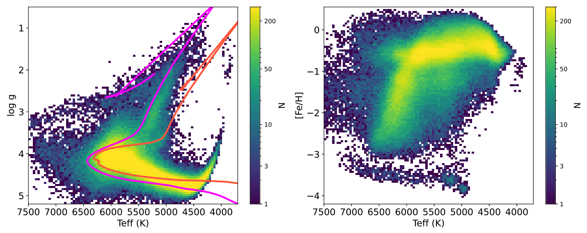

Stellar abundances for a large number of stars provide key information for the study of Galactic formation history. Large spectroscopic surveys such as the Dark Energy Spectroscopic Instrument (DESI) and LAMOST take median-to-low-resolution (R ≲ 5000) spectra in the full optical wavelength range for millions of stars. However, the line-blending effect in these spectra causes great challenges for elemental abundance determination. Here we employ DD-PAYNE, a data-driven method regularized by differential spectra from stellar physical models, to the DESI early data release spectra for stellar abundance determination. Our implementation delivers 15 labels, including effective temperature T eff, surface gravity , microturbulence velocity v mic, and the abundances for 12 individual elements, namely C, N, O, Mg, Al, Si, Ca, Ti, Cr, Mn, Fe, and Ni. Given a spectral signal-to-noise ratio of 100 per pixel, the internal precisions of the label estimates are about 20 K for T eff, 0.05 dex for , and 0.05 dex for most elemental abundances. These results agree with the theoretical limits from the Crámer–Rao bound calculation within a factor of 2. The majority of the accreted halo stars contributed by the Gaia–Enceladus–Sausage are discernible from the disk and in situ halo populations in the resultant [Mg/Fe]–[Fe/H] and [Al/Fe]–[Fe/H] abundance spaces. We also provide distance and orbital parameters for the sample stars, which spread over a distance out to ∼100 kpc. The DESI sample has a significantly higher fraction of distant (or metal-poor) stars than the other existing spectroscopic surveys, making it a powerful data set for studying the Galactic outskirts. The catalog is publicly available.
