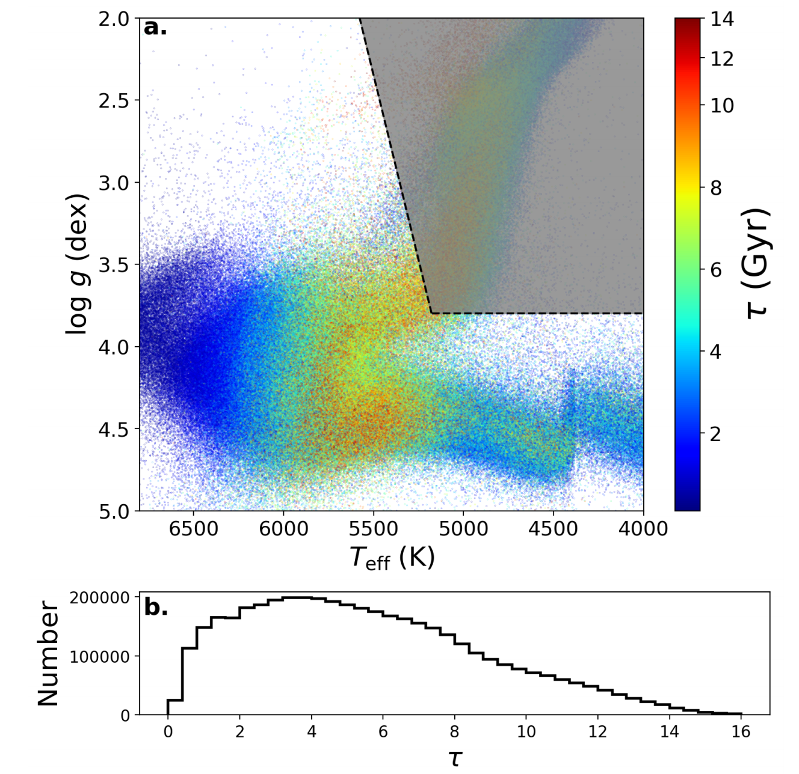

Stellar age determination for large samples of stars opens new avenues for a broad range of astronomical sciences. While precise stellar ages for evolved stars have been derived from large ground- and space-based stellar surveys, reliable age determination for cool main-sequence dwarf stars remains a challenge. In this work, we set out to estimate the age of dwarf stars from the LAMOST spectra with a data-driven approach. We build a training set by using wide binaries that the primary component has reliable isochrone age estimate thus gives the age of the secondary. This training set is further supplemented with field stars and cluster stars whose ages are known. We then train a data-driven model for inferring age from their spectra with the XGBoost algorithm. Given a spectral signal-to-noise ratio greater than 50, the age estimation precise to 10\% to 25\% for K-type stars, as younger stars have larger relative errors. Validations suggest that the underlying information used for our age estimation is largely attributed to the LAMOST spectral features of chemical abundances. It means our result is a manifestation of stellar chemical clock effectively acted on LAMOST spectra ($R\simeq1800$). Applying our model to the LAMOST DR10 yields a massive age catalog for $\sim4$ million dwarf stars. Statistical properties, such as the age distribution, age-abundance and age-stellar activity relations of the sample stars are discussed. The catalog is publicly accessible and can be helpful for extensive sciences from detection and characterization of Earth-like planets to Galactic archaeology.
