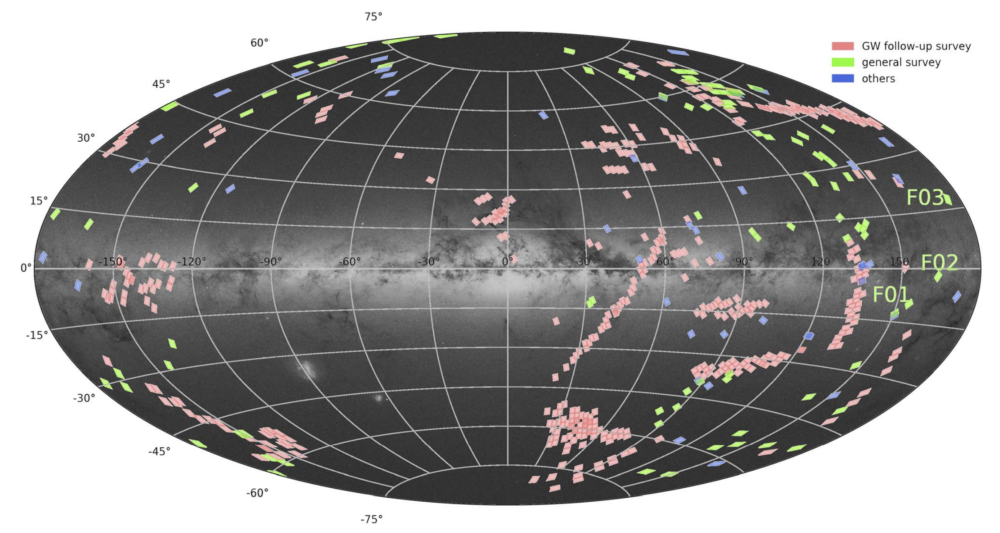

The SiTian project, designed to utilize 60 telescopes distributed across multiple sites in China, is a next-generation time-domain survey initiative. As a pathfinder for the SiTian project, the Mini-SiTian (MST) has been proposed and implemented to test the SiTian’s brain and data pipeline, and to evaluate the feasibility of its technology and science cases. Mounted at the Xinglong Observatory, the MST project comprises three 30\,cm telescopes and has been operated since 2022 November. Each telescope of the MST possesses a large field of view, covering $2.29^{\circ} \times 1.53^{\circ}$ FOV, and is equipped with $g'$, $r'$, and $i'$ filters, respectively. Acting as the pioneer of the forthcoming SiTian project, the MST is dedicated to the discovery of variable stars, transients, and outburst events, and has already obtained some interesting scientific results. In this paper, we will summarize the first two-year operation of the MST project.

