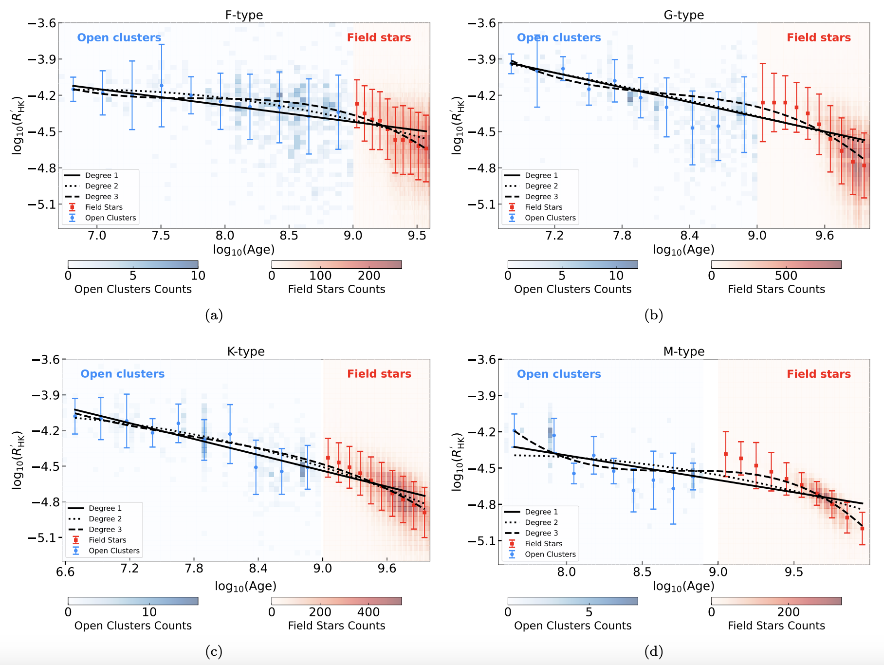

Stellar chromospheric activity serves as a valuable proxy for estimating stellar ages, though its applicable range and accurate functional form are still debated. Utilizing LAMOST spectra, we have compiled a catalog of open cluster members and field stars to investigate $R_{HK}^{'}$–age relations across various spectral types. We find that a linear model, specifically a Skumanich-type relation, can best describe the overall decline of chromospheric activity with age, with the slope varying across different spectral types. However, we also identify variations in the decay rate along the main sequence, which call for more accurate follow-up investigation. Finally, we find that lower-metallicity stars exhibit enhanced activity for F-, G-, and K-type stars, whereas no clear metallicity dependence is observed for M dwarfs.

