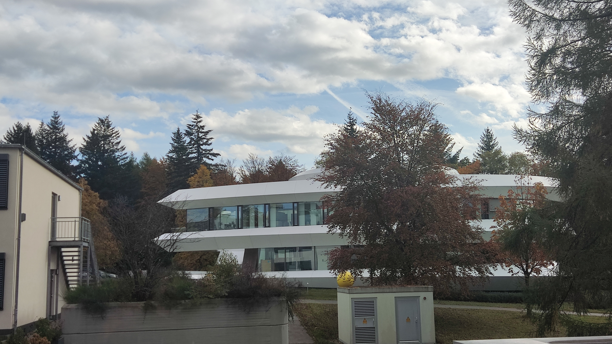

Between 29 October and 12 November 2023, we visited the Max-Planck-Institut für Astronomie (MPIA). MPIA is located in Heidelberg and is built on top of the Throne Mountain. In the picture is the famous attraction, the Old Bridge.

This is MPIA's signature building, the Lecture Hall. It looks very much like a space ship, full of technology and design.

